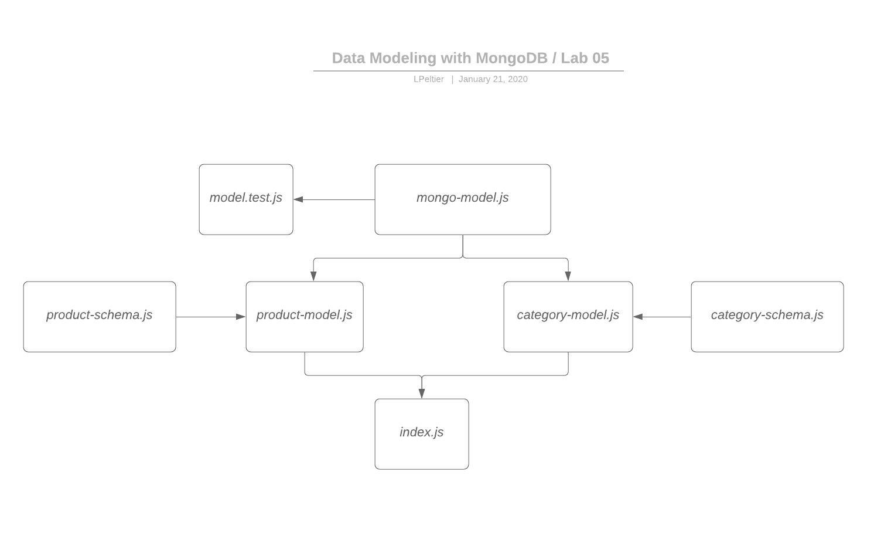

# Apprenti-401-Lab-05

# Data Modeling with MongoDB

## Author: Lindsay Peltier

### Links and Resources

- [Submission PR](https://github.com/LindsayPeltier-401-advanced-javascript/Apprenti-401-Lab-05/pull/1)
- [Travis](https://www.travis-ci.com/LindsayPeltier-401-advanced-javascript/Apprenti-401-Lab-05)

### Documentation

- [JSDoc Index](./docs/index.html)

### Setup

Run NPM install

### `.env` requirements:

MONGODB_URI

### Operations

Run NPM start

### Tests

Run NPM test
Run NPM lint

### UML

